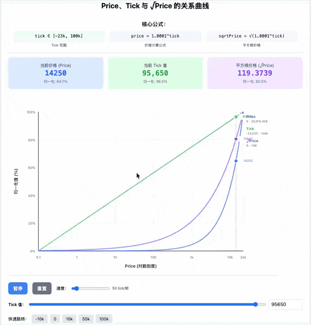

# Uniswap V3 Learn

[中文](#uniswap-v3-learn) | [English](#english-version)



<p align="center">
  <a href="https://geyu210.github.io/tick-price-animation/"><strong>Live Demo: Tick-to-Price Animation</strong></a>
</p>

这是我公开记录 Uniswap V3 学习过程的仓库。这里不是官方实现，也不是生产级合约，而是把学习中的数学推导、最小化合约实现、测试案例和可视化实验放在一起，方便自己复盘，也方便后来的人顺着同一条路学习。

## Tick、Price 与 sqrtPrice 动画

顶部动画展示了 Uniswap V3 里 `tick`、`price` 和 `sqrtPrice` 的关系。它适合在刚开始理解 `price = 1.0001^tick`、`sqrtPriceX96`、价格区间和流动性之前先看一遍。

- 在线体验：[Live Demo: Tick-to-Price Animation](https://geyu210.github.io/tick-price-animation/)
- 源码目录：[txs/tick_to_price/tick-price-animation](txs/tick_to_price/tick-price-animation)

## 推荐学习路线

1. 先看 tick 与价格关系
   - 运行或查看动画，建立 `tick` 是离散价格坐标的直觉。
   - 对照 `unimath.py`、`unimath_2023_8_1.py`、`unimath_mytest.py` 里的计算过程，理解价格、平方根价格和流动性的换算。

2. 再看核心数学库
   - `src/lib/FixedPoint96.sol`：Uniswap V3 常用的 Q64.96 数字格式。
   - `src/lib/Math.sol`：数量变化、下一步价格、舍入逻辑。
   - `src/lib/TickMath.sol`：tick 和 sqrtPrice 之间的互相转换。
   - `src/lib/TickBitmap.sol`：用位图记录哪些 tick 已经被初始化。

3. 然后看最小化 Pool
   - `src/UniswapV3Pool.sol`：池子的状态、添加流动性、交换逻辑。
   - `src/UniswapV3Manager.sol`：帮助用户和 pool 交互。
   - `src/UniswapV3Quoter.sol`：不真正交换，只预估交换结果。

4. 最后用测试串起来
   - `test/lib/Math.t.sol`：验证数学函数。
   - `test/UniswapV3Pool.t.sol`：验证添加流动性和交换。
   - `test/UniswapV3Manage.t.sol`：验证 manager 调用。
   - `test/UniswapV3Quoter.t.sol`：验证报价和真实交换结果是否一致。
   - `test/ticks_pricetest.t.sol`：tick 位置和位图相关的小实验。

## 仓库导览

```text
src/
  UniswapV3Pool.sol        Minimal pool implementation
  UniswapV3Manager.sol     Helper contract for mint and swap
  UniswapV3Quoter.sol      Quote by simulating swap callback revert
  lib/                     Math, tick, bitmap and position libraries
  interfaces/              Callback and pool interfaces

test/
  lib/Math.t.sol           Math-focused tests
  UniswapV3Pool.t.sol      Pool mint and swap tests
  UniswapV3Manage.t.sol    Manager tests
  UniswapV3Quoter.t.sol    Quoter tests
  ticks_pricetest.t.sol    Tick and bitmap experiments

txs/tick_to_price/
  tick-price-animation/    React animation for tick-price relationship

ui/
  React UI experiment

*.py / *.ts
  Learning scripts for price, tick, sqrtPrice and liquidity math
```

## 本地运行

### 1. 安装 Foundry 依赖

需要先安装 [Foundry](https://book.getfoundry.sh/getting-started/installation)。

```bash
forge install --no-git foundry-rs/forge-std rari-capital/solmate PaulRBerg/prb-math@v2.5.0
```

这些依赖会安装到 `lib/` 目录。这个目录在仓库里被忽略，不需要提交。

### 2. 运行 Solidity 测试

```bash
forge build
forge test -vvv
```

### 3. 运行数学脚本

```bash
npm install
npx ts-node mathinjs.ts
python3 unimath.py
```

### 4. 运行 tick-price 动画

```bash
cd txs/tick_to_price/tick-price-animation
npm ci
npm start
```

打开 [http://localhost:3000](http://localhost:3000) 查看页面。

## 重要概念速记

- `tick`：离散的价格坐标，每移动一个 tick，价格按 `1.0001` 的倍数变化。
- `price`：两个 token 的价格比例，可以用 `1.0001^tick` 从 tick 推出。
- `sqrtPriceX96`：把价格的平方根放大 `2^96` 后保存，便于在整数环境里计算。
- `liquidity`：某个价格区间里提供的流动性数量。
- `TickBitmap`：用一个个二进制位记录哪些 tick 有流动性边界。

## Roadmap / Next Steps

- Next: Simulating Uniswap v4 Hooks dynamics & introducing security attack vector visualizations.
- 将现有 tick-price 可视化方式继续扩展到 v4 Hooks、动态交换路径、攻击向量和防御视角的交互演示。

## 学习状态说明

这个仓库保留了一些草稿、实验和中间版本。它们的价值不在于“最终答案”，而在于展示学习 Uniswap V3 时如何从公式、脚本、测试，再慢慢走到合约实现。阅读时建议优先跟着测试和 `src/lib` 看，遇到公式不直观时再回到脚本和动画。

---

## English Version

This repository is a public record of my Uniswap V3 learning process. It is not an official implementation or production-ready contract code. Instead, it collects math notes, minimal contract experiments, tests, scripts, and visual demos so that the learning path can be reviewed and followed by others.

## Tick, Price, And sqrtPrice Animation

The animation at the top shows the relationship between `tick`, `price`, and `sqrtPrice` in Uniswap V3. It is a good first stop before diving into `price = 1.0001^tick`, `sqrtPriceX96`, price ranges, and liquidity.

- Live demo: [Live Demo: Tick-to-Price Animation](https://geyu210.github.io/tick-price-animation/)
- Source: [txs/tick_to_price/tick-price-animation](txs/tick_to_price/tick-price-animation)

## Suggested Learning Path

1. Start with the tick-price relationship
   - Run or watch the animation to build an intuition for `tick` as a discrete price coordinate.
   - Compare it with the calculations in `unimath.py`, `unimath_2023_8_1.py`, and `unimath_mytest.py`.

2. Read the core math libraries
   - `src/lib/FixedPoint96.sol`: Q64.96 fixed-point number format.
   - `src/lib/Math.sol`: token amount deltas, next price, and rounding behavior.
   - `src/lib/TickMath.sol`: conversion between tick and sqrtPrice.
   - `src/lib/TickBitmap.sol`: bitmap storage for initialized ticks.

3. Move to the minimal pool implementation
   - `src/UniswapV3Pool.sol`: pool state, minting liquidity, and swap logic.
   - `src/UniswapV3Manager.sol`: helper contract for interacting with the pool.
   - `src/UniswapV3Quoter.sol`: quote swap results without executing a real swap.

4. Use tests to connect the pieces
   - `test/lib/Math.t.sol`: math function tests.
   - `test/UniswapV3Pool.t.sol`: pool mint and swap tests.
   - `test/UniswapV3Manage.t.sol`: manager interaction tests.
   - `test/UniswapV3Quoter.t.sol`: quote and swap consistency tests.
   - `test/ticks_pricetest.t.sol`: tick position and bitmap experiments.

## Repository Map

```text
src/
  UniswapV3Pool.sol        Minimal pool implementation
  UniswapV3Manager.sol     Helper contract for mint and swap
  UniswapV3Quoter.sol      Quote by simulating swap callback revert
  lib/                     Math, tick, bitmap and position libraries
  interfaces/              Callback and pool interfaces

test/
  lib/Math.t.sol           Math-focused tests
  UniswapV3Pool.t.sol      Pool mint and swap tests
  UniswapV3Manage.t.sol    Manager tests
  UniswapV3Quoter.t.sol    Quoter tests
  ticks_pricetest.t.sol    Tick and bitmap experiments

txs/tick_to_price/
  tick-price-animation/    React animation for tick-price relationship

ui/
  React UI experiment

*.py / *.ts
  Learning scripts for price, tick, sqrtPrice and liquidity math
```

## Local Setup

### 1. Install Foundry Dependencies

Install [Foundry](https://book.getfoundry.sh/getting-started/installation) first.

```bash
forge install --no-git foundry-rs/forge-std rari-capital/solmate PaulRBerg/prb-math@v2.5.0
```

The dependencies are installed into `lib/`, which is ignored by this repository.

### 2. Run Solidity Tests

```bash
forge build
forge test -vvv
```

### 3. Run Math Scripts

```bash
npm install
npx ts-node mathinjs.ts
python3 unimath.py
```

### 4. Run The Tick-Price Animation

```bash
cd txs/tick_to_price/tick-price-animation
npm ci
npm start
```

Open [http://localhost:3000](http://localhost:3000) in a browser.

## Key Concepts

- `tick`: a discrete price coordinate. Each tick moves the price by a factor of `1.0001`.
- `price`: the token price ratio, derived from `1.0001^tick`.
- `sqrtPriceX96`: the square root of price scaled by `2^96`, which makes integer math practical.
- `liquidity`: the amount of liquidity provided inside a price range.
- `TickBitmap`: a compact bitmap that records which ticks are initialized.

## Roadmap / Next Steps

- Next: Simulating Uniswap v4 Hooks dynamics & introducing security attack vector visualizations.
- Extend the current tick-price animation style into interactive simulations for hooks, swap dynamics, attack vectors, and defensive reasoning.

## Learning Status

This repository intentionally keeps some drafts, experiments, and intermediate versions. Their value is not that they are final answers, but that they show the path from formulas and scripts to tests and contract implementations. A good reading order is to start with the tests and `src/lib`, then return to the scripts and animation whenever the math feels too abstract.
